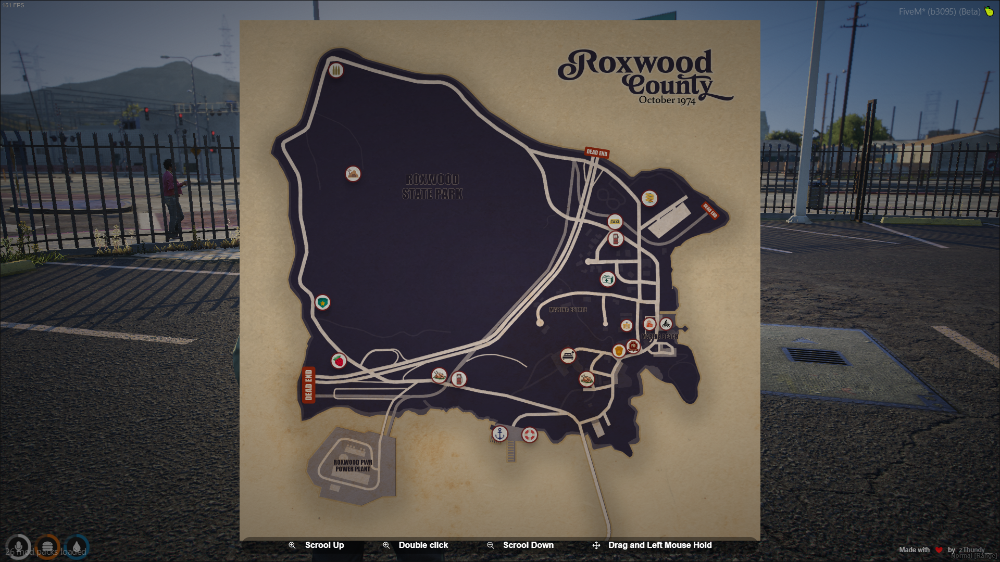
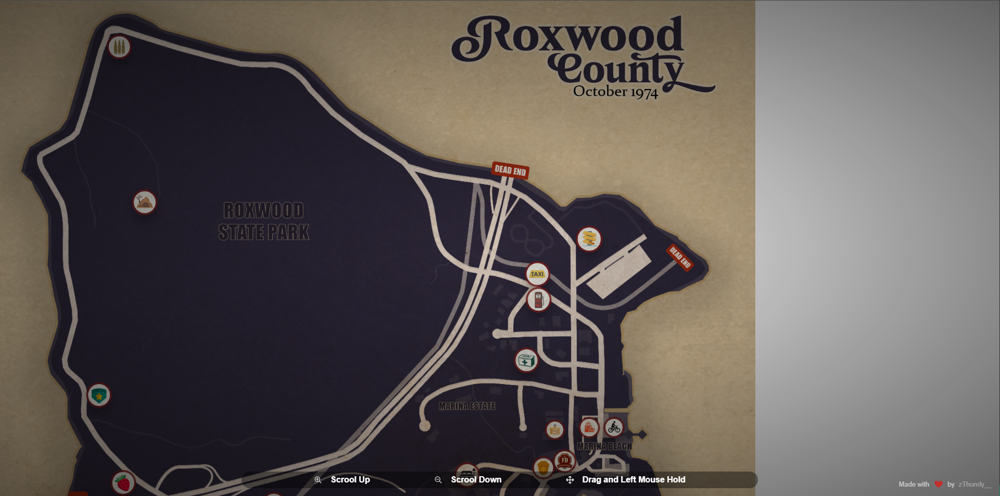

# Fullscreen Image Zoom Website

## Description
A simple website that allows users to zoom in on a fullscreen image. This project demonstrates how to implement image zoom functionality using HTML, CSS, and JavaScript.

## Features
- Fullscreen image display
- Smooth zoom in and zoom out functionality
- Responsive design

## Installation
1. Clone the repository:
    ```sh
    git clone https://github.com/zThundy/zth_fullscreenMap.git
    ```
2. Navigate to the project directory:
    ```sh
    cd zth_fullscreenMap
    ```
3. Open `index.html` in your web browser.

## Usage
- Open the website.
- Click on the image to zoom in.
- Click again to zoom out.

## Technologies
- HTML
- CSS
- JavaScript

## Contributing
1. Fork the repository.
2. Create a new branch:
    ```sh
    git checkout -b feature/your-feature-name
    ```
3. Make your changes and commit them:
    ```sh
    git commit -m 'Add some feature'
    ```
4. Push to the branch:
    ```sh
    git push origin feature/your-feature-name
    ```
5. Open a pull request.

## Images
### Homepage


### Zoomed In


## License
This project is licensed under the MIT License.