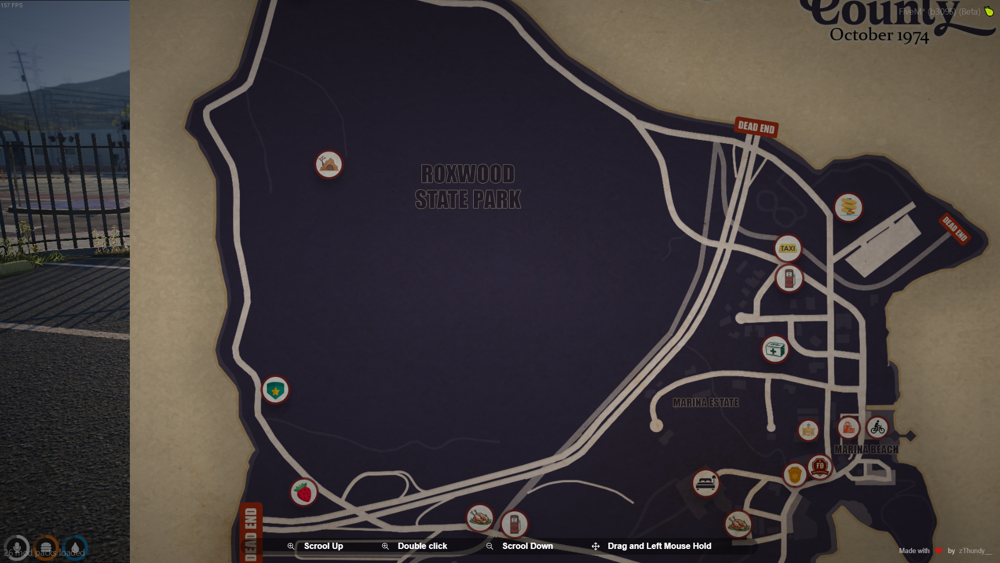

# Fullscreen Image Zoom Website

## Description
A FiveM resource that makes possible zomming on a png image.
Useful to simulate maps (like the provided example) for orienting.

## Features
- Fullscreen image display
- Smooth zoom in and zoom out functionality

## Installation
1. Donwload the release from GitHub or clone the repository
2. Add the folder to your FiveM server
3. Start the resource

## Developing
1. Clone the repository:
    ```sh
    git clone https://github.com/zThundy/zth_fullscreenMap.git
    ```
2. Navigate to the project directory:
    ```sh
    cd zth_fullscreenMap
    ```
3. Open `index.html` in your web browser.

## Usage
- Open the website.
- Click on the image to zoom in.
- Click again to zoom out.

## Technologies
- HTML
- CSS
- JQuery
- JavaScript
- LUA

## Images
### Homepage


### Zoomed In


## License
This project is licensed under the MIT License.